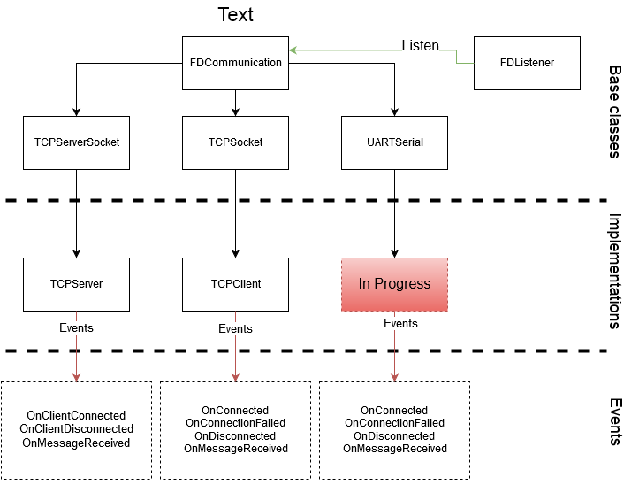

# IO Linux C++ library

This C++ library provide tools to communicate with TCP and UART protocols on an embedded device. It has been created to design a TCP-UART bridge on an arietta G25.

## IO tools

* **FDCommunication** : This class is the C++ representation of a Linux file descriptor. It provides basis functions for files descriptors like *read*, *write* and *close*.

* **FDListener** : This one allows you to watch Linux files descriptors inputs. You can add (*addFD*) and remove (*remFD*) files descriptors and then use the function *listen*. *listen* will wait until there is an input on one of the files descriptors. Finally you can check witch file descriptor has received something with the function *isReceiving*. It avoids your task to be locked by a *read* function when you have several files descriptors to watch.

## Low-level communication tools

* **TCPServerSocket** : This class is an implementation of **FDCommunication** for TCP Server creation. It provides functions like *bind* and *accept*.

* **TCPSocket** : This one is for TCP Client creation. It provides the *connect* function.

* **UARTSerial** : This one is for UART communication. It allows you to *open* a serial device. (In progress)

## High-level communication tools

The library provides high-level communication tools for UART and TCP protocols hiding the low-level stack and allowing an event-based development :

* **TCPServer** : In progress

* **TCPClient** : In progress

* **UARTServer** : In progress